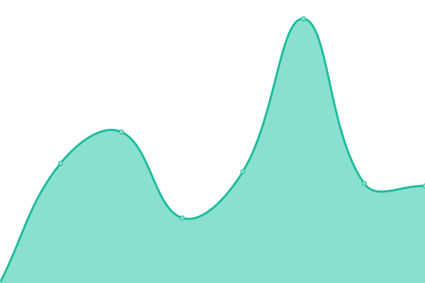

# [📈 Live Status](https://jeremibiz.github.io/upptime): <!--live status--> **🟥 Complete outage**

This repository contains the open-source uptime monitor and status page for [jeremibiz](https://jeremibiz.github.io/upptime), powered by [Upptime](https://github.com/upptime/upptime).

With [Upptime](https://upptime.js.org), you can get your own unlimited and free uptime monitor and status page, powered entirely by a GitHub repository. We use [Issues](https://github.com/jeremibiz/upptime/issues) as incident reports, [Actions](https://github.com/jeremibiz/upptime/actions) as uptime monitors, and [Pages](https://jeremibiz.github.io/upptime) for the status page.

<!--start: status pages-->
<!-- This summary is generated by Upptime (https://github.com/upptime/upptime) -->
<!-- Do not edit this manually, your changes will be overwritten -->
<!-- prettier-ignore -->
| URL | Status | History | Response Time | Uptime |
| --- | ------ | ------- | ------------- | ------ |
|  [Website - morphy.fr.to](https://morphy.fr.to) | 🟥 Down | [website-morphy-fr-to.yml](https://github.com/jeremibiz/upptime/commits/HEAD/history/website-morphy-fr-to.yml) | 

 595ms
     
 | 

<a href="https://jeremibiz.github.io/upptime/history/website-morphy-fr-to">21.68%</a>
    

|  [API - api-morphy.fr.to](https://api-morphy.fr.to/status) | 🟥 Down | [api-api-morphy-fr-to.yml](https://github.com/jeremibiz/upptime/commits/HEAD/history/api-api-morphy-fr-to.yml) | 

 408ms
     
 | 

<a href="https://jeremibiz.github.io/upptime/history/api-api-morphy-fr-to">0.00%</a>
    

|  [Flarum - project-morphy.fr.to](https://project-morphy.fr.to) | 🟥 Down | [flarum-project-morphy-fr-to.yml](https://github.com/jeremibiz/upptime/commits/HEAD/history/flarum-project-morphy-fr-to.yml) | 

 630ms
     
 | 

<a href="https://jeremibiz.github.io/upptime/history/flarum-project-morphy-fr-to">21.83%</a>
    

<!--end: status pages-->

[**Visit our status website →**](https://jeremibiz.github.io/upptime)

## 📄 License

- Powered by: [Upptime](https://github.com/upptime/upptime)
- Code: [MIT](./LICENSE) © [jeremibiz](https://jeremibiz.github.io/upptime)
- Data in the `./history` directory: [Open Database License](https://opendatacommons.org/licenses/odbl/1-0/)
